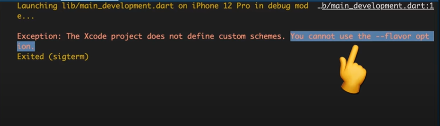
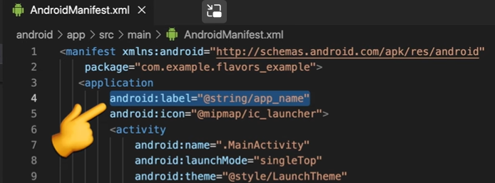

# Environment Setup Method - 1

### Create an env dart file 
```dart
enum Environemnt {
    dev, stage, prod;
}

abstract class AppEnvironment{

    static class String baseUrl = "";
    static class String databaseUrl = "";
    static MaterialColor primarySwatch = 

    static late Environemnt _envionment ;
    static Environment get environment => _environment;

    static setupEnvironment(Environment env){

        _environment = env;

        swtich(env){
            case Environment.dev:
                {
                    baseUrl = "com.dev.app/";
                    databaseUrl = "";
                    primarySwatch = Colors.blue;
                    break;
                }
            case Environment.stage:
                {
                    baseUrl = "com.stg.com/";
                    databaseUrl = "";
                    break;
                }
            case Environment.prod:
                {
                    baseUrl = "";
                    databaseUrl = "";
                    break;
                }
        }
    }

}
```

### create main_dev.dart

```dart
import "package:flutter/material.dart";

void main(){
    AppEnvironment.setupEnvironment(Environment.dev);
    runApp(MyApp());
}
```

### create main_stage.dart

```dart
import "package:flutter/material.dart";

void main(){
    AppEnvironment.setupEnvironment(Environment.stage);
    runApp(MyApp());
}
```

### create main_prod.dart

```dart
import "package:flutter/material.dart";

void main(){
    AppEnvironment.setupEnvironment(Environment.prod);
    runApp(MyApp());
}
```

### Change Target of main file destination 

```cmd
flutter run -t lib/main_dev.dart --flavor stage
```


### Use case of these files

+ Example 1

```dart
primaryColor = AppEnvironment.primaryColor
```
+ Example 2

```dart
MaterialApp(
    debugShowCheckedBanner: AppEnvironment.environment == AppEnvironment.dev ? true : false
);
```

Tutorial
(Android Flavors)[https://www.youtube.com/watch?v=iJPYhV_VMjc]
(iOS Flavors){https://youtu.be/AlOi26zLjyg}

---


# Environment Setup Method 2

## Using Github actions and Flutter_dotenv package.

### Create a github workflow

```yaml
name: deployments
on:
  push:
    branches: [master, staging, dev]

jobs:
  deployDev:
    name: 'Deploy to dev environment'
    if: github.event.ref == 'refs/heads/dev'
    runs-on: ubuntu-latest
    environment:
      name: development
    steps:
      - uses: actions/checkout@v1
      - uses: actions/setup-java@v1
        with:
          java-version: '12.x'
      - uses: SpicyPizza/create-envfile@v1
        with:
          envkey_ENVIRONMENT: ${{ secrets.ENVIRONMENT }}
          envkey_API_URL: ${{ secrets.API_URL }}
      - uses: subosito/flutter-action@v1
        with:
          channel: 'stable'
          flutter-version: '2.5.x'
      - run: flutter pub get
      - run: flutter clean
      - run: flutter build apk --debug
      - uses: actions/upload-artifact@v1
        with:
          name: apk-release
          path: build/app/outputs/flutter-apk/app-release.apk

  deployProd:
    name: 'Deploy to production environment'
    if: github.event.ref == 'refs/heads/master'
    runs-on: ubuntu-latest
    environment:
      name: production
    steps:
      - uses: actions/checkout@v1
      - uses: actions/setup-java@v1
        with:
          java-version: '12.x'
      - uses: SpicyPizza/create-envfile@v1
        with:
          envkey_ENVIRONMENT: ${{ secrets.ENVIRONMENT }}
          envkey_API_URL: ${{ secrets.API_URL }}
      - uses: subosito/flutter-action@v1
        with:
          channel: 'stable'
          flutter-version: '3.10.x'
      - run: flutter pub get
      - run: flutter clean
      - run: flutter build apk
      - uses: actions/upload-artifact@v1
        with:
          name: apk-release
          path: build/app/outputs/flutter-apk/app-release.apk
```

### create an .env file globally
```
ENVIRONMENT=development
API_URL=com.app.dev
```

## Steps
+ register this .env file inside pubspec.yaml
+ Create 2 new branches using git {dev and master}


## URL
[Youtube Video](https://youtu.be/Vto5JHaRcQw)
[Youtube Tutorial](https://www.youtube.com/watch?v=Vto5JHaRcQw)

---
---

# Environment Setup Method 3

+ To change the flavor in VsCode IDE, continue with the following below procedure, and move to "Run and Debug" to launch different flavors.

### Create a Directory called .vscode and add launch.json file
```json
{
    "version": "0.2.0",
    "configurations" : [

        {
            "name": "Launch Development",
            "request" : "launch",
            "type": "dart",
            "program" : "lib/main_dev.dart",
            "args": [
                "-t", "lib/main_dev.dart","--flavor", "dev"]
        },
        {
            "name": "Launch Staging",
            "request" : "launch",
            "type": "dart",
            "program" : "lib/main_stg.dart",
            "args": [
                "-t", "lib/main_stg.dart", "--flavor", "stg"]
        },
         {
            "name": "Launch Production",
            "request" : "launch",
            "type": "dart",
            "program" : "lib/main_prod.dart",
            "args": [
                "-t", "lib/main_prod.dart", "--flavor", "prod"]        }
    ]
}
```

+ You'll probably get error like so:



+ In android >> app >> build.gradle >>
```gradle
   // Specifies one flavor dimension.
    flavorDimensions "default"
    productFlavors {
        dev {
            dimension "default"
            applicationIdSuffix ".dev"
            resValue "string", "app_name", "flavors-dev"
        }
        stg {
            dimension "default"
            applicationIdSuffix ".stg"
            resValue "string", "app_name", "flavors-stg"

        }
        prod {
            dimension "default"
            resValue "string", "app_name", "flavors"

        }
    }
```
## Change App name


+ android:label="@string/app_name"

## Tutorial

[Youtube Video](https://youtu.be/Vhm1Cv2uPko)
